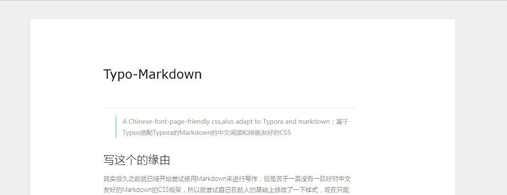
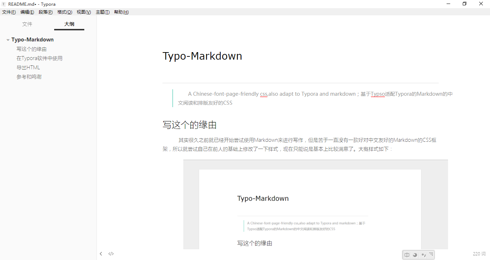

# Typo-Markdown

> A Chinese-font-page-friendly css,also adapt to Typora and markdown；基于Typso适配Typora的Markdown的中文阅读和排版友好的CSS

## 写这个的缘由 

​    其实很久之前就已经开始尝试使用Markdown来进行写作，但是苦于一直没有一款好对中文友好的Markdown的CSS框架，所以就尝试自己在前人的基础上修改了一下样式，现在只能说是基本上比较满意了。大概样式如下：

## 在Typora软件中使用

​    将css文件放到Typora软件的主题文件目录即可，重启Typora，选择该主题即可。

​    在Typora中Markdown的图如下：

## 导出HTML

​    在Typora软件中导出HTML样式如上1图所示

## 参考和鸣谢

​    本css参考了以下内容，在此表示感谢。

1. Typo  [Typo中文CSS排版](https://typo.sofi.sh/)
2. 代码块参考了Github的代码样式。

​    

